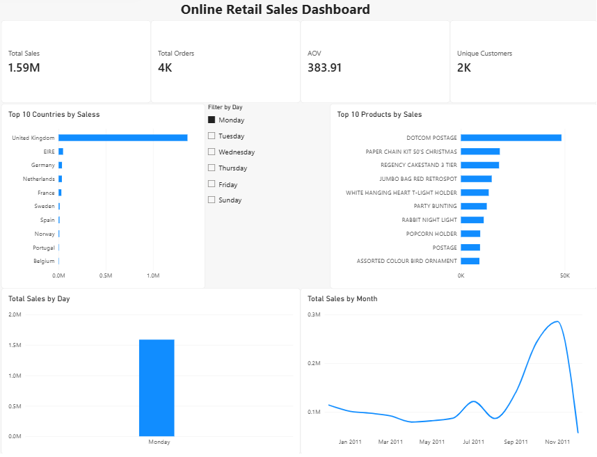
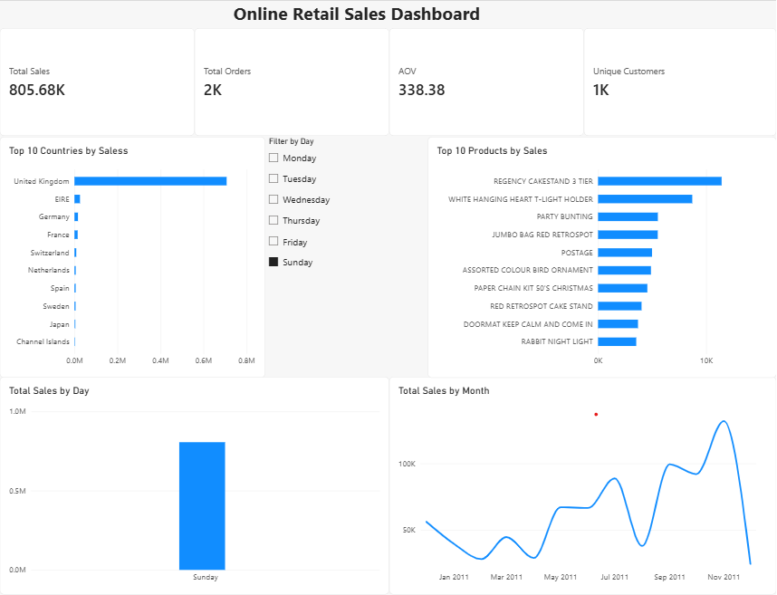

# Online Retail Sales Analytics Dashboard

An end-to-end data analytics project using **Excel, MySQL, Power BI, and DAX** to analyze **541,909 online retail transactions**.

## Tools Used

* **Excel** – Data preparation and validation
* **MySQL** – SQL-based data cleaning and analysis
* **Power BI** – Interactive dashboard development
* **DAX** – Calculated measures and KPIs

## Dataset

**541,909 retail transaction records**

## Dashboard Preview

The dashboard provides an overall view of sales performance across countries, products, days, and months.

## Interactive Filtering

The dashboard includes a **Day Name slicer** that dynamically updates KPIs and visualizations based on the selected day.

### Monday Filter

### Thursday Filter

### Sunday Filter

These filtered views demonstrate how the dashboard responds to different day selections.

## Dashboard Highlights

* Total Sales
* Total Orders
* Unique Customers
* Average Order Value (AOV)
* Top 10 Countries by Sales
* Top 10 Products by Sales
* Monthly Sales Trends
* Day-wise Sales Analysis
* Interactive Day Filter

## Project Workflow

**Raw Dataset → Excel Preparation → MySQL Analysis → Power BI Dashboard**

## Project Overview

The project analyzes online retail transaction data to identify sales trends and business insights. Data was prepared and validated using Excel, analyzed using MySQL, and visualized through an interactive Power BI dashboard.

## Files

* Power BI dashboard (`.pbix`)
* Dashboard screenshots
* Project documentation

## Key Learning

This project provided hands-on experience with the complete analytics workflow, from data preparation and SQL analysis to building an interactive Power BI dashboard using DAX.

